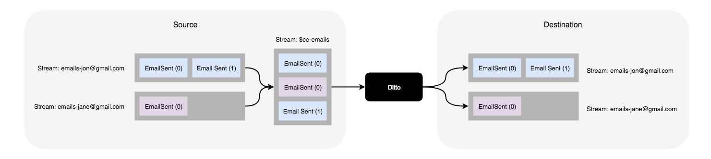

# Ditto

Ditto is a cluster replication tool for [Event Store](http://eventstore.org). It works by subscribing to specific streams from a _source_ cluster and replicating them to a _destination_ cluster.

It was designed to be run as a standalone application using Docker and uses [Event Store Subscription Groups](https://eventstore.com/docs/dotnet-api/competing-consumers/index.html) to subscribe to the source server/cluster.

Most of the code is part of our boilerplate Event Consumer template and automatically takes care of Event Store connection management and logging via Serilog. The application is configured to use [Seq](https://datalust.co/seq) locally and Datadog in production.

### Docker Image

Docker images are hosted on https://hub.docker.com/r/benfoster/ditto.

```
docker pull benfoster/ditto
```


### Configuration

The application can be configured via JSON (`appsettings.json`) or using Environment Variables:

| JSON Setting | Environment Variable | Default Value | Description |
| ------------ | -------------------- | ----------- | ----------- |
| SourceEventStoreConnectionString | Ditto_Settings__SourceEventStoreConnectionString |   | The source event store connection string |
| DestinationEventStoreConnectionString | Ditto_Settings__DestinationEventStoreConnectionString |   | The destination event store connection string |
| PersistentSubscriptionBufferSize | Ditto_Settings__PersistentSubscriptionBufferSize | 10 | The buffer size of the subscription. This should be increased for large, frequently updated streams |
| ReplicationThrottleInterval | Ditto_Settings__ReplicationThrottleInterval | 0 | The interval in milliseconds to wait between events. This can be useful if you want to reduce the load on your source server |
| SkipVersionCheck | Ditto_Settings__SkipVersionCheck | false | Whether to skip the version check when replicating streams. This may need to be enabled if you are partially replicating streams rather than reading from the beginning |
| Subscriptions | Ditto_Settings__Subscriptions |  | Array of the persistent subscriptions that should be used for replication |

#### Idempotency

Events are replicated without modification. Event Store provides best effort idempotency based on the Stream and Event identifiers. If version checking is enabled (see above) then Event Store guarantees idempotency. [More information](https://eventstore.com/docs/dotnet-api/optimistic-concurrency-and-idempotence/index.html#idempotence).

### Metrics

Metrics are exposed on http://localhost:5000/metrics in Prometheus format.

### Replication Considerations

Ditto was originally designed to replicate the `$all` system stream. However, I found that this resulted in the replication of a lot of internal streams/events which we did not want. Since it's [not currently possible](https://github.com/EventStore/EventStore/issues/718) to ignore system streams I opted to explicitly specify the streams to replicate.

We usually subscribe to category streams e.g. `$ce-emails` and then populate the original streams on the destination cluster, for example:



### Running locally

To run the example, clone the repository and run `docker-compose -f docker-compose.yml -f docker-compose.apps.yml up --build`. This will start:

1. Source Event Store at [http://localhost:2113](http://localhost:2113)
2. Destination Event Store at [http://localhost:4113](http://localhost:4113)
3. SEQ at [http://localhost:5341](http://localhost:5341)
4. Ditto

The docker setup will automatically seed the source event store with "customer" events that you can view at http://localhost:2113/web/index.html#/streams/$ce-customer and setup a persistent subscription for the `$ce-customer` category stream.

Ditto will connect to the persistent subscription and start consuming events.

To test the replication you can use the Event Store HTTP API to create some customer events on the source:

```
curl --location --request POST 'http://localhost:2113/streams/customer-6d3d4dca-9889-416b-a266-4bf760261f01' \
-u admin:changeit \
-H 'Content-Type: application/vnd.eventstore.events+json' \
--data-raw '[
    {
        "eventId": "ab932527-5b9a-4868-82f3-42194bbfd022",
        "eventType": "customer_registered",
        "data": {
            "first_name": "John",
            "last_name": "Smith",
            "phone_number": "0111111111111"
        },
        "metadata": {
            "source": "ditto"
        }
    }
]'
```

You should then be able to browse to the stream at [http://localhost:2113/web/index.html#/streams/customer-6d3d4dca-9889-416b-a266-4bf760261f01](http://localhost:2113/web/index.html#/streams/customer-6d3d4dca-9889-416b-a266-4bf760261f01) and see the event in the `$ce-customer` category stream at [http://localhost:213/web/index.html#/streams/$ce-customer](http://localhost:2113/web/index.html#/streams/$ce-customer).

Ditto will then replicate this event to the destination server/cluster. You should see output similar to the following in stdout and in SEQ:

```
Replicating customer_registered #0 from customer-cbea713f-b396-46f4-8c67-81e04b37d334 (Original Event: #16) completed in 17.7 ms
```

You should then be able to browse to the same stream on the destination server at [http://localhost:4113/web/index.html#/streams/customer-6d3d4dca-9889-416b-a266-4bf760261f01](http://localhost:4113/web/index.html#/streams/customer-6d3d4dca-9889-416b-a266-4bf760261f01).
